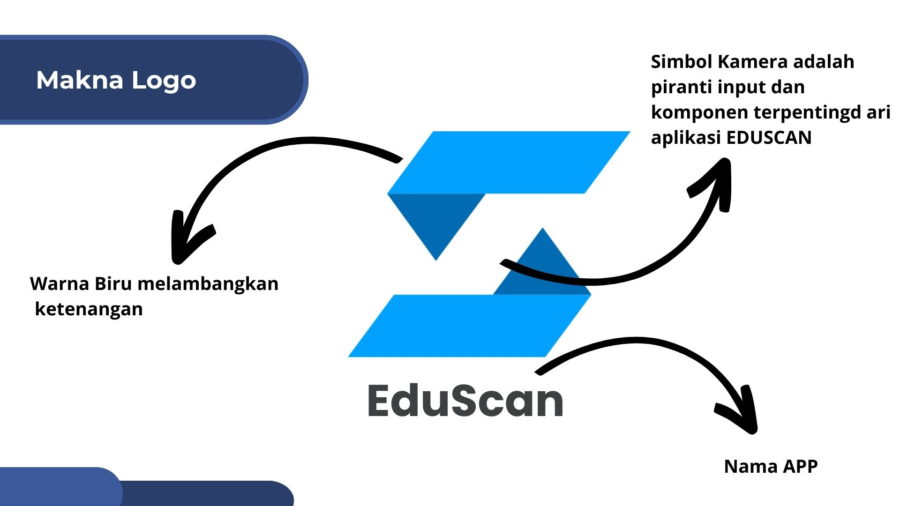
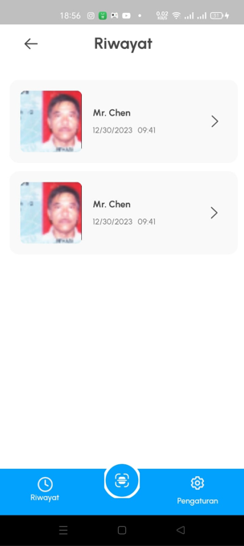
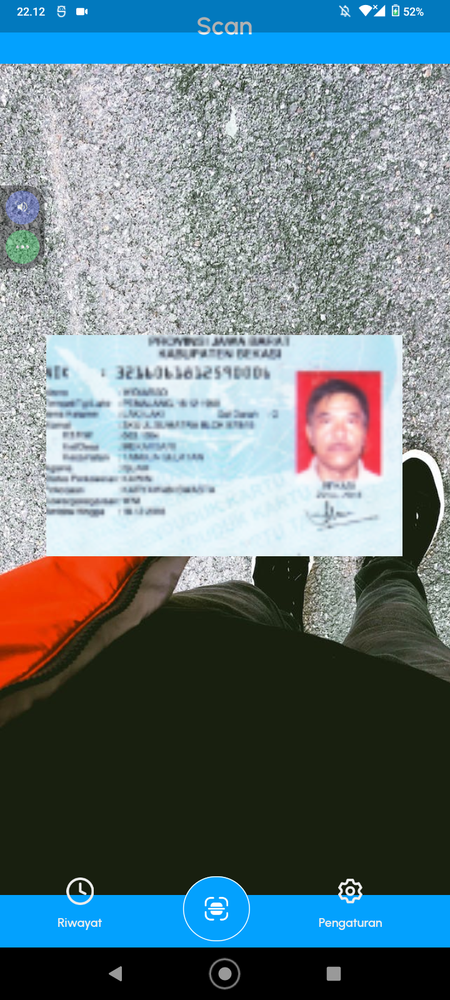
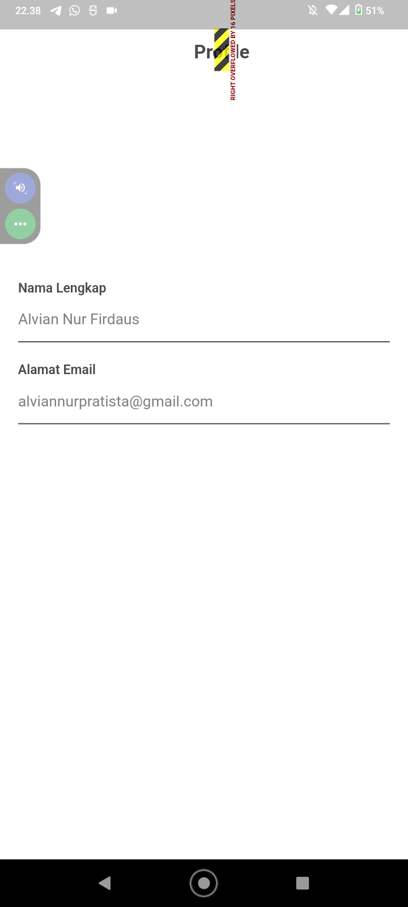
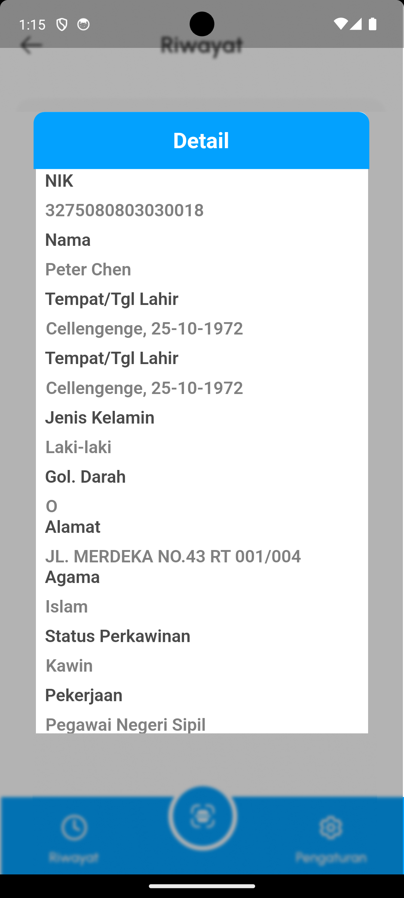
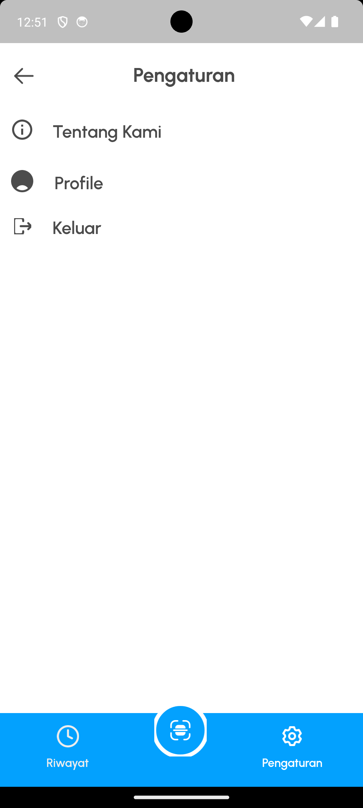
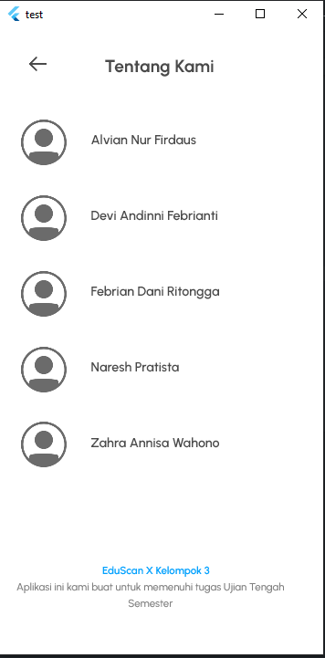
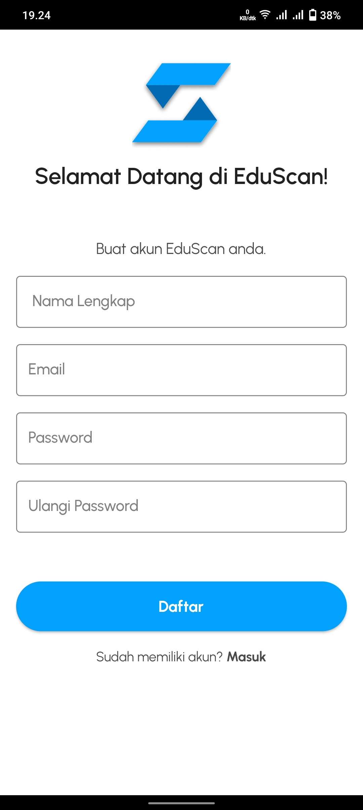
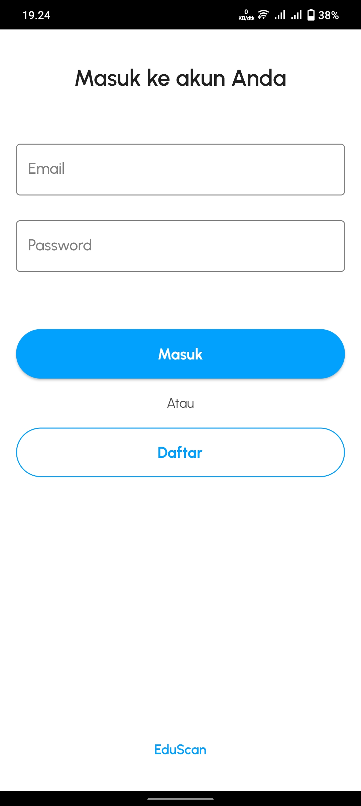

------

### **Laporan Praktikum UTS**
### **Implementasi Desain Figma kedalam bentuk Flutter**
### **Kelompok 3**

---

<table>
  <tr>
    <th>Nama Anggota Kelompok</th>
    <th>NIM</th>
  </tr>
  <tr>
    <th>Alvian Nur Firdaus</th>
    <th>2141720022</th>
  </tr>
  <tr>
    <th>Devi Andini Febrianti</th>
    <th>2141720189</th>
  </tr>
  <tr>
    <th>Febrian Dani Ritonga</th>
    <th>2141720022</th>
  </tr>
  <tr>
    <th>Naresh Pratista</th>
    <th>2141720057</th>
  </tr>
  <tr>
    <th>Zahra Anisa W</th>
    <th>2141720016</th>
  </tr>
</table>

 

----

### **Pendahuluan**
Pada Project OCR KTP ini Kelompok 3 akan menggunakan nama "EduScan" yaitu kepanjangan dari Edukasi Scaner, Edukasi memiliki arti yaitu tim kami beranggotakan 5 tim akan terus berproses dan belajar untuk mengembangkan dan membuat aplikasi Eduscan ini berjalan dengan lancar. Sedangkan Scan berarti project utama kami yaitu melakukan Scanner KTP untuk kemudian dilakukan sebuah proses recognition.

Berikut adalah Logo dan Makna Logo dari EduScan 

 

---------

### **Perancangan Desain di Figma**

[Berikut adalah Link Figma dari Kelompok 3 (klik)](https://www.figma.com/file/9XPK2XwwCoCkYM8SRXOoKW/UTS-MOBILE?type=design&node-id=6-2906&mode=design&t=3JgDwsVJwcaXs7wq-0)

 

---------

### **Implementasi kedalam bentuk Flutter**

>**Alvian Nur Firdaus**

>- Detail Jobdesk : Pembuatan Splash Screen dan Riwayat
>- Link Repository : [Repository Alvian (klik)](https://github.com/alvianfirdaus/2141720022-mobile-2023/tree/main/week-09/src/UTS)

<table>
  <tr>
    <th>Splash Screen</th>
    <th>Riwayat</th>
  </tr>
  <tr>
    <th></th>
    <th></th>
  </tr>
</table>

>**Devi Andini Febrianti**

>- Detail Jobdesk : Pembuatan Scanner dan Riwayat
>- Link Repository : [Devi Andini (klik)](https://github.com/deviandinifebrianti/2141720189-Mobile-2023/tree/main/ocr_ktp)

<table>
  <tr>
    <th>Scanner</th>
    <th>Profil</th>
  </tr>
  <tr>
    <th></th>
    <th></th>
  </tr>
</table>

>**Febrian Dani Ritonga**

>- Detail Jobdesk : Pembuatan Detail Riwayat dan Setting
>- Link Repository : [Repository Febrian (klik)](https://github.com/daniertg/2141720070-mobile-2023/tree/master/UTS)

<table>
  <tr>
    <th>Detail Riwayat</th>
    <th>Settings</th>
  </tr>
  <tr>
    <th></th>
    <th></th>
  </tr>
</table>

>**Naresh Pratista**

>- Detail Jobdesk : Data hasil Scan dan about us
>- Link Repository : -

<table>
  <tr>
    <th>Hasil Scan</th>
    <th>About us</th>
  </tr>
  <tr>
    <th></th>
    <th></th>
  </tr>
</table>

>**Zahra Anisa Wahono**

>- Detail Jobdesk : Pembuatan Register dan Login
>- Link Repository : [Zahra Anisa (klik)](https://github.com/zhrnnsw/2141720016-mobile-2023/tree/main/week-9/src/eduscan)

<table>
  <tr>
    <th>Register</th>
    <th>Login</th>
  </tr>
  <tr>
    <th></th>
    <th></th>
  </tr>
</table>

 

---------

### **Penutup**
Copyright Kelompok 3 @ 2023

